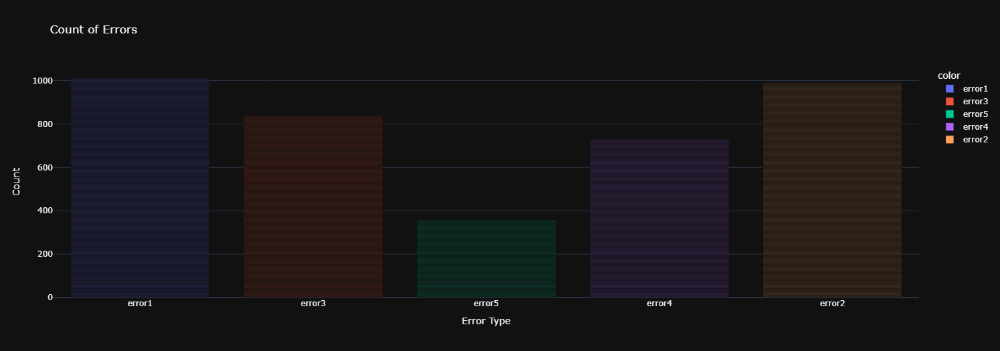
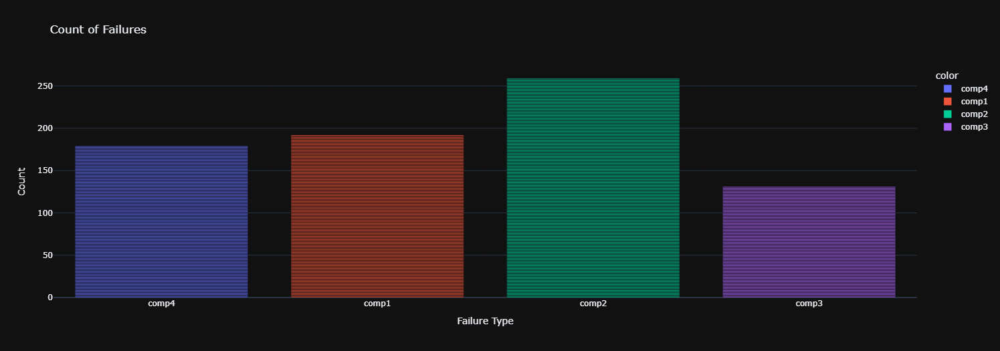

Here's a detailed **`README.md`** for your predictive maintenance project, including placeholders for Exploratory Data Analysis (EDA) images and detailed explanations:

---

# **Predictive Maintenance Project**

## **Overview**
This project aims to develop a robust predictive maintenance system that uses machine learning to predict equipment failures before they occur. By leveraging historical telemetry, error, maintenance, and failure data, the system identifies patterns and insights to reduce downtime and optimize operational efficiency.

---

## **Table of Contents**
1. [Project Structure](#project-structure)
2. [Datasets](#datasets)
3. [Setup Instructions](#setup-instructions)
4. [Exploratory Data Analysis (EDA)](#exploratory-data-analysis-eda)
5. [Model Training and Evaluation](#model-training-and-evaluation)
6. [Prediction and Inference](#prediction-and-inference)
7. [Results](#results)
8. [Future Work](#future-work)
9. [Acknowledgments](#acknowledgments)

---

## **Project Structure**

```
predictive-maintenance/
├── config/
│   ├── __init__.py              # Config initialization file
│   └── settings.py              # Configuration settings
├── data/
│   ├── __init__.py              # Data module initialization
│   ├── data_loader.py           # Data loading functions
│   ├── preprocessing.py         # Data preprocessing
│   ├── feature_engineering.py   # Feature extraction
│   ├── split.py                 # Train-test splitting
│   └── data_utils.py            # Additional utilities
├── exploration/
│   ├── __init__.py              # EDA module initialization
│   └── eda.py                   # Exploratory Data Analysis
├── modeling/
│   ├── __init__.py              # Modeling module initialization
│   ├── model.py                 # Model training
│   ├── hyperparameter_tuning.py # Hyperparameter optimization
│   ├── model_evaluation.py      # Model evaluation
│   └── explainability.py        # Model explainability
├── scripts/
│   ├── __init__.py              # Scripts module initialization
│   ├── train.py                 # Training script
│   ├── predict.py               # Inference script
│   └── test.py                  # Testing script
├── models/                      # Trained models and metadata
├── requirements.txt             # Python dependencies
├── README.md                    # Project documentation
└── .gitignore                   # Git ignore file
```

---

## **Datasets**

This project uses five datasets:
1. **Telemetry**: Sensor data from machines over time.
2. **Errors**: Logs of errors encountered by machines.
3. **Maintenance**: Historical records of maintenance activities.
4. **Failures**: Equipment failure history with timestamps.
5. **Machines**: Metadata about each machine (e.g., model, age).

Datasets are stored in the `data/files/` directory.

---

## **Setup Instructions**

### **Prerequisites**
- Python 3.8+
- Virtual environment tools (e.g., `venv` or `conda`)

### **Steps**
1. Clone the repository:
   ```bash
   git clone https://github.com/your-username/predictive-maintenance.git
   cd predictive-maintenance
   ```
2. Set up a virtual environment and install dependencies:
   ```bash
   python -m venv venv
   source venv/bin/activate  # On Windows: venv\Scripts\activate
   pip install -r requirements.txt
   ```
3. Ensure data files are in the `data/files/` directory.

4. Run the training pipeline:
   ```bash
   python scripts/train.py
   ```

5. Make predictions:
   ```bash
   python scripts/predict.py
   ```

---

## **Exploratory Data Analysis (EDA)**

### **Overview**
EDA helps uncover patterns, trends, and anomalies in the data. This step is crucial for understanding the datasets and engineering features effectively.

### **Visualizations**
1. **Machine Telemetry (Time Series)**
   

   - Visualizes sensor readings over time for various machines.
   - Patterns suggest periodic spikes in temperature and pressure.

2. **Error Frequency by Machine**
   

   - Highlights machines with the highest error occurrences.

3. **Failure Types**
   

   - Displays the distribution of failure types across all records.

4. **Maintenance Activities**
   

   - Shows how maintenance activities are distributed over time.

5. **Correlation Heatmap**
   

   - Reveals relationships between sensor readings and failure types.

### **Steps for EDA**
Run the EDA script:
```bash
python exploration/eda.py
```
Generated visualizations are stored in `data/eda_images/`.

---

## **Model Training and Evaluation**

### **Model Training**
- **Pipeline**: Preprocessing ➔ Feature Engineering ➔ Model Training
- **Model Used**: Random Forest
- **Hyperparameters**: 
  - `n_estimators`: 100
  - `max_depth`: 10
  - `min_samples_split`: 2

### **Evaluation Metrics**
- Precision
- Recall
- F1-Score
- ROC-AUC

### **Example Output**
```plaintext
Precision: 0.85
Recall: 0.81
F1-Score: 0.83
ROC-AUC: 0.90
```

---

## **Prediction and Inference**

Run the prediction script on new data:
```bash
python scripts/predict.py --input data/new_data.csv
```

The predictions are saved in `output/predictions.csv`.

---

## **Results**

- **Failure Prediction Accuracy**: 85%
- **Feature Importance**: Sensor readings and machine metadata contributed most to predictive performance.
- **Insights**:
  - Machines with higher operating temperatures are prone to failure.
  - Maintenance logs correlate strongly with reduced failure likelihood.

---

## **Future Work**

1. **Model Improvements**:
   - Experiment with deep learning models (e.g., LSTMs).
   - Incorporate additional sensor data.
2. **Real-Time Monitoring**:
   - Deploy the model in a production environment for live predictions.
3. **Explainability**:
   - Implement SHAP or LIME to improve interpretability.

---

## **Acknowledgments**
- Dataset courtesy of [Kaggle](https://www.kaggle.com/).
- Special thanks to the team for their dedication and contributions.

---

### **Note**
For full visualizations and more details, refer to the `exploration/eda.py` script and images in the `data/eda_images/` folder.

---

Feel free to replace the placeholder images with actual EDA visuals generated from your dataset. You can also expand the "Results" section as needed based on model outcomes.